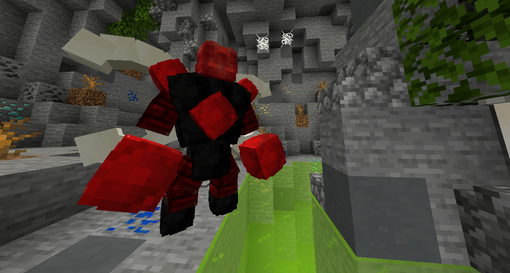

# Pets

## Informations

Sur FrenchSky, vous retrouverez beaucoup de pets différents. Ils n'ont pas de réelle utilité, cependant, ils vous suivront partout où vous irez ! Sur votre île, dans les donjons, dans les mines ou bien dans l'end et le nether !


#### Certains pets ont une rareté différente des autres. Certains seront obtenables très facilement, d'autres vous donneront du fil à retordre !

#### Il y a 5 raretés différentes ! Commun, peu commun, rare, epic, légendaire ! **Pourrez-vous tous les obtenir ?!**


## Où peut-on obtenir des pets ?

* En achetant **sur la boutique** [_\(clique ici pour y accéder\)_](https://store.frenchsky.net/)\_\_
* **Lors d'évènements** ou bien **de giveaways** disponibles sur le discord [_\(clique ici pour y accéder\)_](https://discordapp.com/invite/YxgDvvQ)\_\_
* **En passant le grade FrenchGOD**, un pet vous sera donné automatiquement !
* **Dans le /bs pevent** lors d'évènements IG **en échange de PEvents** !

## Menu de configuration

Vous pouvez **choisir le pet** que vous souhaitez faire apparaître **avec la commande /mpet**.  
**Un clic droit sur votre pet** **vous permettra d'ouvrir un menu** qui vous **donnera la possibilité de monter dessus**, **changer son nom** ainsi que de **le retirer**.


_**Si votre pet ne veut pas apparaître, c'est sûrement parce qu'il y a le pet d'un autre joueur pas très loin ! Il vous suffit de vous éloigner un peu et de le refaire apparaître !**_


