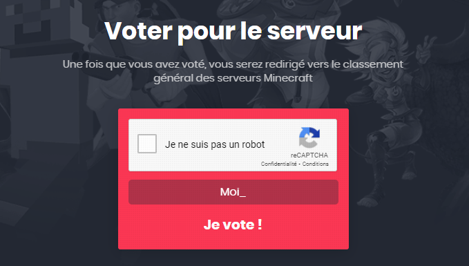

# Comment voter

### **Récompenses** :

Vous obtiendrez 1 clef de vote par votes.  
Au bout d'un certain nombre de votes vous entrerez dans des paliers et les tokens vous seront versés automatiquement.  
Vous pourrez récupérer vos clefs de votes en faisant la commande /key get vote.  
  
**Récompenses de palier** :  
130 Votes = +150 Tokens  
220 Votes = +150 Tokens  
310 Votes = +150 Tokens  
400 Votes = +150 Tokens  
490 Votes = +200 Tokens  
580 Votes = +200 Tokens  
670 Votes = +200 Tokens  
760 Votes = +200 Tokens  
850 Votes = +200 Tokens  
_**À noter que les paliers sont cumulables.**_

Tout d'abord, il faudra que vous alliez sur le site et aller dans la section "vote".  
Entrez le pseudonyme que vous avez en jeu, puis cliquez sur "voter".  
Vous aurez par la suite, la possibilité de voter pour 6 sites différents. Notez bien que chaque site à son propre cooldown après chaque vote.

### **Vous pouvez voter de deux façons, via le site comme ci-dessous** :

1. **Serveur-prive.net** _\(Vote disponible toute les 1h30\)_

Cliquez simplement sur le captcha puis sur "Je vote !". Revenez ensuite sur la page de vote et attendez simplement que le vote se confirme, rien de plus simple ! Le procédé est quasiment le même pour chaque site.

2. **Top-serveurs.net** _\(Vote disponible toute les 1h30\)_

Cliquez simplement sur "Voter", puis encore une fois sur "Voter", puis revenez sur la page de vote et attendez que le vote se confirme.

3. **Serveur-minecraft.com** _\(Vote disponible toute les 3h\)_

Remplissez simplement le captcha, puis cliquez sur "Voter". Revenez ensuite sur la page de vote et attendez que le vote se confirme.

4. **RPG-paradize.com** _\(Vote disponible toute les 3h\)_

Remplissez simplement le captcha, puis cliquez sur "Voter". Revenez ensuite sur la page de vote et attendez que le vote se confirme.

5. **Serveurs minecraft.org** _\(Vote disponible toute les 24h\)_

Cliquez simplement sur "VOTER POUR FRENCHSKY", puis une fenêtre apparaîtra et remplissez le captcha puis cliquez sur "CONFIRMER LE VOTE". Revenez ensuite sur la page de vote et attendez que le vote se confirme.

6. **Serveurs-minecraft.org** _\(Vote disponible toute les 24h\)_

Descendez un peu la page, jusqu'à voir "VOTER POUR FRENCH SKY". Cliquez dessus, une fenêtre s'ouvrira, remplissez le captcha et cliquez sur "Ok". Revenez ensuite sur la page de vote et attendez que le vote se confirme.

### **Ou bien directement en jeu, avec la commande /vote** :

\[Insérer un screen du /vote\]

Il vous suffira de cliquer sur les minecarts, puis de cliquer sur les liens dans le chat pour voter, vous n'aurez pas besoin de passer par le site de FrenchSky. Vos récompenses seront distribuées de la même façon.

Et voilà ! Vous venez de voter pour FrenchSky ! Merci pour votre soutien et profitez bien de vos récompenses !😉

