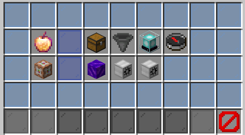

# Hoppers modifiés

### Informations basiques


**Les hoppers modifiés sont extrêmement utiles** **pour éviter une utilisation excessive de hoppers**.  
Vous pourrez **les modifier en les tapant d'un clic gauche** pour ouvrir un menu, et **changer chaque caractéristique de ces derniers**.


  
Vous pourrez **les obtenir via le /bs shops** et **ne pourrez les poser que sur votre île**.  
Comme vous pouvez le voir sur le screen ci-dessous, **la ligne du haut vous servira aux améliorations** de votre hopper et **celle du bas aux actions possibles pour configurer** votre hopper.

### Configuration

**La liaison** d'un hopper **permet** à ce dernier **de transférer son contenant directement dans un autre hopper** ou **un autre coffre**, et ce **même si ces derniers ne sont pas côte à côte**.  
Un **simple clic sur** "**LIER A UN CONTENEUR**" puis **un clic droit sur l'autre conteneur** sur lequel vous voulez lier votre hopper suffit ! **Faites attention à améliorer suffisamment votre hopper** **pour pouvoir le lier sur de longues distances**.  
**Des filtres sont également disponibles**, vous pouvez décider **que votre hopper ne ramassera que certains items particuliers**, ou au contraire, **qu'il ne ramassera pas certains items particuliers** !

### Améliorations

#### **Les liaisons & la distance de liaison**

Cette amélioration consiste à **augmenter le nombre de liaison possible entre les contenants**.  
Par exemple, vous pourrez **lier ce hopper à plusieurs coffres** en même temps.

Vous pouvez également **améliorer la distance de liaison**, extrêmement utile pour ne pas se retrouver avec énormément de hoppers sur son île. Les hoppers **pourront se lier entre eux** _\(ou bien se lier avec un coffre\)_ **sur de plus longues distances**.

#### Taux de transfert & aspiration

Vous pouvez **améliorer le taux de transfert d'item par seconde**.  
Les items se transféreront ainsi **plus rapidement** d'un hopper à un autre contenant, très pratique pour les grosses usines !

**Améliorer la distance d'aspiration** vous sera plus que nécessaire pour vos farms. L'améliorer vous **permettra de faire grandir le rayon d'aspiration** du hopper, plus besoin que l'item se trouve juste au dessus du hopper avec cette amélioration !.


_**Chaque amélioration a un coût en FrenchCoins !**_


